# MeirDownloader — Enhancement Architecture

## Overview

This document describes the architecture for seven major enhancements to the MeirDownloader WPF Desktop app. The current app downloads lessons sequentially with a single global progress bar. The enhanced version will support parallel downloads with per-lesson progress, folder picking, skip-already-downloaded logic, loading indicators, correct lesson numbering, and filtering of empty series.

---

## Current Architecture Summary

```
MeirDownloader.Core/
  Models/         → Lesson, Rabbi, Series, DownloadProgress (POCOs)
  Services/       → IMeirDownloaderService, MeirDownloaderService

MeirDownloader.Desktop/
  MainWindow.xaml      → UI layout (code-behind pattern, no MVVM)
  MainWindow.xaml.cs   → All logic in code-behind
```

**Key problems with current design:**
- All UI logic lives in `MainWindow.xaml.cs` code-behind — no separation of concerns
- Downloads are sequential via a `for` loop in `DownloadLessonsWithNumbering`
- Single global `ProgressBar` — no per-lesson tracking
- No skip logic for already-downloaded files
- No folder picker — hardcoded path
- No loading indicators for API calls
- Series with 0 lessons can appear in the list

---

## New File Structure

```
MeirDownloader.Desktop/
  ViewModels/
    LessonViewModel.cs          → Per-lesson observable wrapper
    MainViewModel.cs            → Main window state and commands (future MVVM)
  Services/
    DownloadManager.cs          → Parallel download orchestration
  Converters/
    DownloadStatusToColorConverter.cs
    DownloadStatusToTextConverter.cs
  MainWindow.xaml               → Enhanced UI layout
  MainWindow.xaml.cs            → Simplified code-behind delegating to DownloadManager

MeirDownloader.Core/
  Models/
    DownloadStatus.cs           → New enum for lesson download states
    Lesson.cs                   → Unchanged
    DownloadProgress.cs         → Unchanged
  Services/
    IMeirDownloaderService.cs   → Add file-existence check method
    MeirDownloaderService.cs    → Add file-existence check, keep download logic
```

---

## 1. ViewModel Design — `LessonViewModel`

### File: `MeirDownloader.Desktop/ViewModels/LessonViewModel.cs`

This class wraps a `Lesson` model with observable properties for UI binding. It implements `INotifyPropertyChanged` to drive per-row progress bar updates.

```csharp
using System.ComponentModel;
using System.Runtime.CompilerServices;
using MeirDownloader.Core.Models;

namespace MeirDownloader.Desktop.ViewModels;

public enum DownloadStatus
{
    Ready,          // Not yet downloaded, waiting
    Downloading,    // Currently downloading
    Complete,       // Successfully downloaded
    Error,          // Download failed
    Skipped,        // File already exists on disk
    Cancelled       // User cancelled
}

public class LessonViewModel : INotifyPropertyChanged
{
    public Lesson Lesson { get; }

    // Assigned after sorting all lessons by date ascending
    public int LessonNumber { get; set; }

    // Display properties delegating to Lesson
    public string Id => Lesson.Id;
    public string Title => Lesson.Title;
    public string RabbiName => Lesson.RabbiName;
    public string SeriesName => Lesson.SeriesName;
    public string Date => Lesson.Date;
    public string AudioUrl => Lesson.AudioUrl;

    // --- Observable download state ---

    private DownloadStatus _status = DownloadStatus.Ready;
    public DownloadStatus Status
    {
        get => _status;
        set { _status = value; OnPropertyChanged(); OnPropertyChanged(nameof(StatusText)); OnPropertyChanged(nameof(IsDownloadable)); }
    }

    private int _progressPercentage;
    public int ProgressPercentage
    {
        get => _progressPercentage;
        set { _progressPercentage = value; OnPropertyChanged(); }
    }

    private string _errorMessage = string.Empty;
    public string ErrorMessage
    {
        get => _errorMessage;
        set { _errorMessage = value; OnPropertyChanged(); }
    }

    // Computed properties for UI binding
    public string StatusText => Status switch
    {
        DownloadStatus.Ready => "מוכן",
        DownloadStatus.Downloading => $"{ProgressPercentage}%",
        DownloadStatus.Complete => "הושלם ✅",
        DownloadStatus.Error => "שגיאה ❌",
        DownloadStatus.Skipped => "הורד כבר ✅",
        DownloadStatus.Cancelled => "בוטל",
        _ => ""
    };

    public bool IsDownloadable => Status == DownloadStatus.Ready || Status == DownloadStatus.Error || Status == DownloadStatus.Cancelled;

    // File path where this lesson would be saved
    public string GetExpectedFilePath(string downloadPath)
    {
        var rabbiDir = Path.Combine(downloadPath, SanitizeFileName(RabbiName));
        var seriesDir = Path.Combine(rabbiDir, SanitizeFileName(SeriesName));
        var fileName = $"{LessonNumber:D3}-{SanitizeFileName(Title)}.mp3";
        return Path.Combine(seriesDir, fileName);
    }

    public LessonViewModel(Lesson lesson, int lessonNumber)
    {
        Lesson = lesson;
        LessonNumber = lessonNumber;
    }

    private static string SanitizeFileName(string fileName)
    {
        var invalidChars = Path.GetInvalidFileNameChars();
        var sanitized = new string(fileName.Where(c => !invalidChars.Contains(c)).ToArray());
        return string.IsNullOrWhiteSpace(sanitized) ? "Unknown" : sanitized;
    }

    // INotifyPropertyChanged
    public event PropertyChangedEventHandler? PropertyChanged;
    protected void OnPropertyChanged([CallerMemberName] string? name = null)
        => PropertyChanged?.Invoke(this, new PropertyChangedEventArgs(name));
}
```

### Key Design Decisions
- `LessonNumber` is set externally after sorting all lessons by date ascending
- `StatusText` is a computed property that updates when `Status` or `ProgressPercentage` changes
- `GetExpectedFilePath` centralizes file path logic for both download and skip-check
- `SanitizeFileName` is duplicated from the service to keep the ViewModel self-contained for path computation

---

## 2. Download Manager — Parallel Downloads

### File: `MeirDownloader.Desktop/Services/DownloadManager.cs`

This class orchestrates parallel downloads using `SemaphoreSlim` and `Task.WhenAll`.

```csharp
using System.Collections.ObjectModel;
using MeirDownloader.Core.Models;
using MeirDownloader.Core.Services;
using MeirDownloader.Desktop.ViewModels;

namespace MeirDownloader.Desktop.Services;

public class DownloadManager
{
    private readonly IMeirDownloaderService _downloaderService;
    private readonly SemaphoreSlim _semaphore;
    private CancellationTokenSource? _cts;

    public int MaxConcurrentDownloads { get; }

    // Events for UI updates
    public event Action<int, int>? OverallProgressChanged; // completed, total
    public event Action<string>? StatusChanged;

    public DownloadManager(IMeirDownloaderService downloaderService, int maxConcurrent = 4)
    {
        _downloaderService = downloaderService;
        MaxConcurrentDownloads = maxConcurrent;
        _semaphore = new SemaphoreSlim(maxConcurrent, maxConcurrent);
    }

    /// Downloads all provided lessons in parallel with semaphore throttling.
    public async Task DownloadAllAsync(
        IReadOnlyList<LessonViewModel> lessons,
        string downloadPath,
        CancellationToken ct)
    {
        _cts = CancellationTokenSource.CreateLinkedTokenSource(ct);
        var token = _cts.Token;

        int completed = 0;
        int total = lessons.Count(l => l.Status != DownloadStatus.Skipped);

        // Launch all downloads concurrently — semaphore limits actual parallelism
        var tasks = lessons
            .Where(l => l.IsDownloadable)
            .Select(async lessonVm =>
            {
                await _semaphore.WaitAsync(token);
                try
                {
                    await DownloadSingleAsync(lessonVm, downloadPath, token);
                    var done = Interlocked.Increment(ref completed);
                    OverallProgressChanged?.Invoke(done, total);
                }
                finally
                {
                    _semaphore.Release();
                }
            })
            .ToArray();

        await Task.WhenAll(tasks);
    }

    /// Downloads a single lesson, updating the LessonViewModel's observable properties.
    private async Task DownloadSingleAsync(
        LessonViewModel lessonVm,
        string downloadPath,
        CancellationToken ct)
    {
        lessonVm.Status = DownloadStatus.Downloading;
        lessonVm.ProgressPercentage = 0;

        var progress = new Progress<DownloadProgress>(p =>
        {
            lessonVm.ProgressPercentage = p.ProgressPercentage;
        });

        try
        {
            await _downloaderService.DownloadLessonAsync(
                lessonVm.Lesson,
                downloadPath,
                lessonVm.LessonNumber,
                progress,
                ct);

            lessonVm.ProgressPercentage = 100;
            lessonVm.Status = DownloadStatus.Complete;
        }
        catch (OperationCanceledException)
        {
            lessonVm.Status = DownloadStatus.Cancelled;
            throw;
        }
        catch (Exception ex)
        {
            lessonVm.ErrorMessage = ex.Message;
            lessonVm.Status = DownloadStatus.Error;
            // Don't rethrow — let other downloads continue
        }
    }

    /// Checks which lessons already exist on disk and marks them as Skipped.
    public void MarkAlreadyDownloaded(
        IReadOnlyList<LessonViewModel> lessons,
        string downloadPath)
    {
        foreach (var lessonVm in lessons)
        {
            var expectedPath = lessonVm.GetExpectedFilePath(downloadPath);
            if (File.Exists(expectedPath))
            {
                lessonVm.Status = DownloadStatus.Skipped;
                lessonVm.ProgressPercentage = 100;
            }
        }
    }

    public void Cancel()
    {
        _cts?.Cancel();
    }
}
```

### Parallel Download Flow


### Key Design Decisions
- **`SemaphoreSlim` with max 4** — prevents overwhelming the server and the user's bandwidth
- **`Task.WhenAll`** — all downloads launch immediately but are throttled by the semaphore
- **Individual error handling** — one failed download doesn't cancel others
- **`CancellationTokenSource.CreateLinkedTokenSource`** — allows both user cancellation and parent cancellation
- **`Progress<DownloadProgress>`** — marshals callbacks to the UI thread automatically in WPF

---

## 3. XAML Layout Changes

### 3.1 Menu Bar with Folder Picker

Add a `Menu` or toolbar area between the header and main content:

```xml
<!-- Settings Bar - new Row 1 -->
<Grid Grid.Row="1" Background="#34495E" Height="40">
    <StackPanel Orientation="Horizontal" VerticalAlignment="Center" Margin="15,0">
        <Button Content="📁 בחר תיקייה" Click="ChooseFolder_Click"
                Background="#3498DB" Foreground="White" Padding="10,5" Cursor="Hand"
                Margin="0,0,10,0"/>
        <TextBlock x:Name="DownloadPathText"
                   Text="תיקיית הורדה: ..." Foreground="#ECF0F1"
                   VerticalAlignment="Center" FontSize="12"
                   TextTrimming="CharacterEllipsis" MaxWidth="600"/>
    </StackPanel>
</Grid>
```

The main Grid row definitions change from 3 rows to 4:
```xml
<Grid.RowDefinitions>
    <RowDefinition Height="Auto"/>   <!-- Header -->
    <RowDefinition Height="Auto"/>   <!-- Settings/Folder bar -->
    <RowDefinition Height="*"/>      <!-- Main content -->
    <RowDefinition Height="Auto"/>   <!-- Footer -->
</Grid.RowDefinitions>
```

### 3.2 Loading Indicators in Sidebar

Add indeterminate progress bars below each ListBox:

```xml
<!-- Rabbi loading indicator -->
<ProgressBar x:Name="RabbiLoadingBar" Height="3" IsIndeterminate="True"
             Foreground="#3498DB" Visibility="Collapsed" Margin="0,2,0,0"/>

<!-- Series loading indicator -->
<ProgressBar x:Name="SeriesLoadingBar" Height="3" IsIndeterminate="True"
             Foreground="#3498DB" Visibility="Collapsed" Margin="0,2,0,0"/>
```

And in the main content area, a lessons loading indicator:

```xml
<!-- Lessons loading overlay -->
<ProgressBar x:Name="LessonsLoadingBar" Height="3" IsIndeterminate="True"
             Foreground="#3498DB" Visibility="Collapsed" Margin="15,0,15,5"/>
```

### 3.3 Enhanced DataGrid with Per-Lesson Progress

Replace the current DataGrid columns with:

```xml
<DataGrid Grid.Row="1" x:Name="LessonsGrid" AutoGenerateColumns="False"
          Background="White" RowHeaderWidth="0" BorderThickness="0"
          Margin="15,0,15,10" IsReadOnly="True" SelectionMode="Single"
          ItemsSource="{Binding}">
    <DataGrid.Columns>
        <!-- Lesson Number -->
        <DataGridTextColumn Header="#" Binding="{Binding LessonNumber}" Width="40"/>

        <!-- Lesson Title -->
        <DataGridTextColumn Header="שם השיעור" Binding="{Binding Title}" Width="*"/>

        <!-- Date -->
        <DataGridTextColumn Header="תאריך" Binding="{Binding Date}" Width="100"/>

        <!-- Progress Bar + Status Column -->
        <DataGridTemplateColumn Header="סטטוס" Width="180">
            <DataGridTemplateColumn.CellTemplate>
                <DataTemplate>
                    <Grid>
                        <ProgressBar Value="{Binding ProgressPercentage}"
                                     Maximum="100" Height="22"
                                     Foreground="{Binding Status, Converter={StaticResource StatusToColorConverter}}"/>
                        <TextBlock Text="{Binding StatusText}"
                                   HorizontalAlignment="Center" VerticalAlignment="Center"
                                   FontSize="11" FontWeight="SemiBold"/>
                    </Grid>
                </DataTemplate>
            </DataGridTemplateColumn.CellTemplate>
        </DataGridTemplateColumn>

        <!-- Individual Download Button -->
        <DataGridTemplateColumn Header="פעולה" Width="70">
            <DataGridTemplateColumn.CellTemplate>
                <DataTemplate>
                    <Button Content="הורד" Click="DownloadButton_Click"
                            Background="#27AE60" Foreground="White"
                            Padding="8,4" Cursor="Hand"
                            IsEnabled="{Binding IsDownloadable}"/>
                </DataTemplate>
            </DataGridTemplateColumn.CellTemplate>
        </DataGridTemplateColumn>
    </DataGrid.Columns>
</DataGrid>
```

### 3.4 Status Converters

#### File: `MeirDownloader.Desktop/Converters/DownloadStatusToColorConverter.cs`

```csharp
public class DownloadStatusToColorConverter : IValueConverter
{
    public object Convert(object value, Type targetType, object parameter, CultureInfo culture)
    {
        return (DownloadStatus)value switch
        {
            DownloadStatus.Ready => Brushes.LightGray,
            DownloadStatus.Downloading => Brushes.DodgerBlue,
            DownloadStatus.Complete => new SolidColorBrush(Color.FromRgb(0x27, 0xAE, 0x60)),  // green
            DownloadStatus.Error => new SolidColorBrush(Color.FromRgb(0xE7, 0x4C, 0x3C)),     // red
            DownloadStatus.Skipped => new SolidColorBrush(Color.FromRgb(0x95, 0xA5, 0xA6)),    // gray-green
            DownloadStatus.Cancelled => Brushes.Orange,
            _ => Brushes.LightGray
        };
    }

    public object ConvertBack(object value, Type targetType, object parameter, CultureInfo culture)
        => throw new NotImplementedException();
}
```

### 3.5 Overall Progress Bar

The existing global `ProgressBar` at the bottom remains but now shows overall series progress:
- Value = `(completed + skipped) / total * 100`
- `StatusText` shows: `"הורדה: 12/50 הושלמו (4 מקבילים)"`

---

## 4. File Naming — Correct Lesson Numbering

### Current Problem
In `DownloadLessonsWithNumbering`, the index is simply `i + 1` from the loop — this only works if lessons are already sorted. The current `GetAllLessonsAsync` does sort by date ascending, but `GetLessonsAsync` (page 1 only, 20 results) does not.

### Solution
1. **Always use `GetAllLessonsAsync`** when downloading a series — this fetches ALL pages and sorts by date ascending
2. **Assign `LessonNumber`** after sorting: `lessons[i].LessonNumber = i + 1`
3. **File naming format**: `{LessonNumber:D3}-{SanitizedTitle}.mp3` — e.g., `001-פרשת בראשית.mp3`
4. **When loading lessons for display** (not download), also sort by date ascending and assign numbers so the UI shows correct numbering

### Implementation in `MainWindow.xaml.cs`

```csharp
private List<LessonViewModel> CreateNumberedViewModels(List<Lesson> lessons)
{
    // lessons should already be sorted by date ascending from GetAllLessonsAsync
    return lessons
        .Select((lesson, index) => new LessonViewModel(lesson, index + 1))
        .ToList();
}
```

---

## 5. Skip Logic — Already-Downloaded Files

### Flow

```mermaid
flowchart TD
    A[Lessons loaded into DataGrid] --> B[For each LessonViewModel]
    B --> C[Compute expected file path]
    C --> D{File.Exists?}
    D -->|Yes| E[Set Status = Skipped]
    D -->|No| F[Set Status = Ready]
    E --> G[Set ProgressPercentage = 100]
    F --> H[Set ProgressPercentage = 0]
    G --> I[Row shows gray-green bar with text: הורד כבר ✅]
    H --> J[Row shows empty bar with text: מוכן]
```



### When to Check
1. **On series selection** — when lessons are loaded into the grid
2. **On folder change** — re-check all currently displayed lessons
3. **After download completes** — the lesson is already marked Complete, no re-check needed

### Implementation

The `DownloadManager.MarkAlreadyDownloaded` method handles this. It is called:
- In `SeriesListBox_SelectionChanged` after creating `LessonViewModel` list
- In `ChooseFolder_Click` after the user picks a new folder

---

## 6. Folder Picker

### Implementation in `MainWindow.xaml.cs`

```csharp
private void ChooseFolder_Click(object sender, RoutedEventArgs e)
{
    var dialog = new System.Windows.Forms.FolderBrowserDialog
    {
        Description = "בחר תיקייה להורדת שיעורים",
        SelectedPath = _downloadPath,
        ShowNewFolderButton = true
    };

    if (dialog.ShowDialog() == System.Windows.Forms.DialogResult.OK)
    {
        _downloadPath = dialog.SelectedPath;
        DownloadPathText.Text = $"תיקיית הורדה: {_downloadPath}";

        // Re-check skip status for currently displayed lessons
        if (LessonsGrid.ItemsSource is IEnumerable<LessonViewModel> lessons)
        {
            _downloadManager.MarkAlreadyDownloaded(lessons.ToList(), _downloadPath);
        }
    }
}
```

### Default Path Change
Change from `Path.Combine(UserProfile, "מוריד שיעורים")` to:
```csharp
_downloadPath = Environment.GetFolderPath(Environment.SpecialFolder.MyMusic);
```

### Required Reference
Add `<UseWindowsForms>true</UseWindowsForms>` to the `.csproj` to use `FolderBrowserDialog`, OR use the WPF-native `OpenFolderDialog` available in .NET 8:

```csharp
var dialog = new Microsoft.Win32.OpenFolderDialog
{
    Title = "בחר תיקייה להורדת שיעורים",
    InitialDirectory = _downloadPath
};

if (dialog.ShowDialog() == true)
{
    _downloadPath = dialog.FolderName;
    // ...
}
```

> **Recommendation**: Use `Microsoft.Win32.OpenFolderDialog` since the project targets .NET 8 and this avoids the WinForms dependency.

---

## 7. Filter 0-Lesson Series

### Current State
`GetSeriesForRabbiAsync` already filters by `rabbiSpecificCount > 0`. The `GetAllSeriesAsync` uses `hide_empty=true`. However, the rabbi-specific count might still show 0 if the API data is inconsistent.

### Solution
Add an explicit filter in the UI layer when setting the series list:

```csharp
var series = await _downloaderService.GetSeriesAsync(rabbi.Id);
SeriesListBox.ItemsSource = series.Where(s => s.Count > 0).ToList();
```

This is a simple defensive filter — no architectural change needed.

---

## 8. Loading Indicators

### Pattern
Each async operation follows this pattern:

```csharp
private async void LoadRabbis()
{
    try
    {
        RabbiLoadingBar.Visibility = Visibility.Visible;
        StatusText.Text = "טוען רבנים...";

        var rabbis = await _downloaderService.GetRabbisAsync();
        RabbiListBox.ItemsSource = rabbis;

        StatusText.Text = $"נטענו {rabbis.Count} רבנים";
    }
    catch (Exception ex)
    {
        StatusText.Text = $"שגיאה: {ex.Message}";
    }
    finally
    {
        RabbiLoadingBar.Visibility = Visibility.Collapsed;
    }
}
```

Same pattern for `LoadSeries` and `LoadLessons`. The `IsIndeterminate="True"` property on the ProgressBar creates an animated "working" indicator.

---

## 9. Code Structure — Method Signatures and Responsibilities

### `MainWindow.xaml.cs` — Simplified Code-Behind

```csharp
public partial class MainWindow : Window
{
    private readonly IMeirDownloaderService _downloaderService;
    private readonly DownloadManager _downloadManager;
    private string _downloadPath;
    private List<LessonViewModel>? _currentLessons;

    // Constructor
    public MainWindow()

    // Data loading
    private async void LoadRabbis()
    private async void RabbiListBox_SelectionChanged(...)
    private async void SeriesListBox_SelectionChanged(...)
    private void RefreshButton_Click(...)

    // Folder
    private void ChooseFolder_Click(...)

    // Downloads
    private async void DownloadButton_Click(...)        // Single lesson
    private async void DownloadSeriesButton_Click(...)   // Full series via GetAllLessonsAsync
    private async void DownloadAllButton_Click(...)      // Currently displayed lessons
    private void CancelDownloadButton_Click(...)

    // Helpers
    private List<LessonViewModel> CreateNumberedViewModels(List<Lesson> lessons)
    private void CheckSkipStatus()                       // Calls DownloadManager.MarkAlreadyDownloaded
    private void SetDownloadingState(bool isDownloading)
    private void UpdateDownloadButtonStates()
    private void UpdateOverallProgress(int completed, int total)
}
```

### `DownloadManager.cs` — Download Orchestration

```csharp
public class DownloadManager
{
    public int MaxConcurrentDownloads { get; }
    public event Action<int, int>? OverallProgressChanged;
    public event Action<string>? StatusChanged;

    public DownloadManager(IMeirDownloaderService service, int maxConcurrent = 4)

    public async Task DownloadAllAsync(IReadOnlyList<LessonViewModel> lessons, string downloadPath, CancellationToken ct)
    public async Task DownloadSingleAsync(LessonViewModel lessonVm, string downloadPath, CancellationToken ct)
    public void MarkAlreadyDownloaded(IReadOnlyList<LessonViewModel> lessons, string downloadPath)
    public void Cancel()
}
```

### `LessonViewModel.cs` — Observable Lesson Wrapper

```csharp
public class LessonViewModel : INotifyPropertyChanged
{
    public Lesson Lesson { get; }
    public int LessonNumber { get; set; }

    // Delegating properties: Id, Title, RabbiName, SeriesName, Date, AudioUrl

    // Observable: Status, ProgressPercentage, ErrorMessage
    // Computed: StatusText, IsDownloadable

    public string GetExpectedFilePath(string downloadPath)
}
```

### `DownloadStatus` enum — in `LessonViewModel.cs` or separate file

```csharp
public enum DownloadStatus { Ready, Downloading, Complete, Error, Skipped, Cancelled }
```

---

## 10. Revised Download Flow — End to End


---

## 11. Project File Changes

### `MeirDownloader.Desktop.csproj`

No additional NuGet packages needed. The only potential change:

```xml
<!-- Only if using FolderBrowserDialog instead of OpenFolderDialog -->
<UseWindowsForms>true</UseWindowsForms>
```

Since we target .NET 8, `Microsoft.Win32.OpenFolderDialog` is available natively — **no csproj change needed**.

---

## 12. Implementation Order

The recommended implementation order, designed so each step produces a working app:

1. **Add `DownloadStatus` enum and `LessonViewModel` class** — foundation for all other changes
2. **Update `MainWindow.xaml` layout** — add menu bar, loading indicators, new DataGrid columns with progress bars, converters
3. **Add `DownloadManager` class** — parallel download orchestration with semaphore
4. **Update `MainWindow.xaml.cs`** — wire up folder picker, loading indicators, use `LessonViewModel` list, delegate downloads to `DownloadManager`
5. **Implement skip logic** — `MarkAlreadyDownloaded` called on series load and folder change
6. **Implement correct numbering** — use `GetAllLessonsAsync` for series display, sort + number
7. **Filter 0-lesson series** — add `.Where(s => s.Count > 0)` filter
8. **Test and polish** — verify parallel downloads, progress bars, cancellation, error states

---

## 13. Edge Cases and Considerations

| Scenario | Handling |
|----------|----------|
| User changes folder mid-download | Disable folder picker while downloading |
| User clicks Download Series twice | Disable button while downloading; `_isDownloading` guard |
| Download fails for one lesson | Mark as Error, continue others, show count at end |
| User cancels mid-download | Cancel all via `CancellationTokenSource`, mark remaining as Cancelled |
| Server returns no Content-Length | `ProgressPercentage` stays 0; show indeterminate or just status text |
| File exists but is 0 bytes or corrupt | Current skip logic only checks `File.Exists` — could add size check later |
| Very large series with 500+ lessons | Semaphore limits to 4 concurrent; UI remains responsive via async |
| RTL layout with progress bars | Progress bars work fine in RTL; text alignment may need testing |
| Lesson title contains invalid filename chars | `SanitizeFileName` already handles this |
